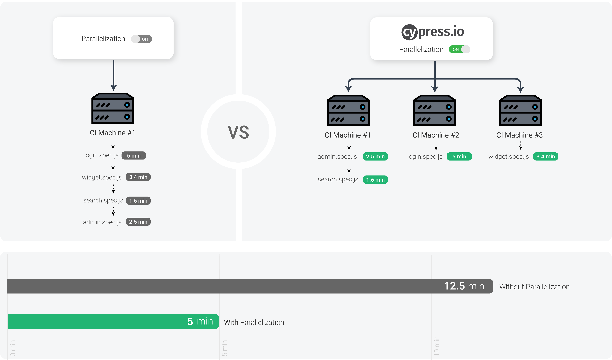

## Commands:
----------------------------------------------------------------------------------------------------------

### 1. Iteration of items: 
    cy.get('.fixed_wrapper .prdocutname').each(($el, index, $list) => {
                if ($el.text().includes('Curls to straight Shampoo')) {
                    cy.wrap($el).click();
                }
----------------------------------------------------------------------------------------------------------

### 2. Handling Multiple tabs - Remove target attribute:
    cy.get('#contact-us').invoke('removeAttr', 'target').click({ force: true });
----------------------------------------------------------------------------------------------------------

### 3. Different Origin Policy: 
    cy.origin('webdriveruniversity.com', () => {
            cy.visit("/");
        })

        cy.origin('google.com', () => {
            cy.visit("/");
        })
----------------------------------------------------------------------------------------------------------

### 4. Browser Navigations:
    cy.visit("https://www.webdriveruniversity.com/");
    cy.get('#contact-us').invoke('removeAttr', 'target').click({ force: true });
    cy.go('back');
    cy.reload();
    cy.go('forward');
----------------------------------------------------------------------------------------------------------

### 5. Javascript Alert Popup: 
    cy.get('#button1').click();
    cy.on('window:alert', (str) =>{
    expect(str).to.equal('I am an alert box!');
    })
----------------------------------------------------------------------------------------------------------

### 6. Javascript Confirm Popup: 

#### Select Ok/true -
    cy.get('#button4').click();
    cy.on('window:confirm', (str) => {
        return true;  
    })
    cy.get('#confirm-alert-text').contains('You pressed Ok!');

#### Select Cancel/false -
    cy.get('#button4').click();
    cy.on('window:confirm', (str) => {
        return false;  
    })
    cy.get('#confirm-alert-text').contains('You pressed Cancel!');
----------------------------------------------------------------------------------------------------------

### 7. Handle Checkboxes: 

#### Check the checkbox -
    cy.get('#checkboxes > :nth-child(1) > input').as('option-1')
    cy.get('@option-1').check().should('be.checked');

#### Uncheck the checkbox -
    cy.get(':nth-child(5) > input').as('option-3')
    cy.get('@option-3').uncheck().should('not.be.checked');    

#### Check the multiple checkbox -
    cy.get('input[type="checkbox"]').check(['option-1', 'option-2', 'option-3', 'option-4'])
        .should('be.checked');
----------------------------------------------------------------------------------------------------------

### 8. Handle Radio buttons:

#### no option is selected/disabled -
    cy.get('#radio-buttons').find('[type="radio"]').first().check();
    cy.get('#radio-buttons').find('[type="radio"]').eq(1).check();

#### options are already selected/disabled -
    cy.get('[value="lettuce"]').should('not.be.checked');
    cy.get('[value="cabbage"]').should('be.disabled');
    cy.get('[value="pumpkin"]').should('be.checked');

    cy.get('[value="lettuce"]').check().should('be.checked');
    cy.get('[value="pumpkin"]').should('not.be.checked');
----------------------------------------------------------------------------------------------------------

### 9. Handle Dropdown lists: 

#### based on value tag -
    cy.get('#dropdowm-menu-1').select('python').should('have.value', 'python');

#### based on text -
    cy.get('#dropdowm-menu-2').select('TestNG').contains('TestNG');
----------------------------------------------------------------------------------------------------------

### 10. Handle iFrames:
    cy.get('#frame').then($iframe => {
    const body = $iframe.contents().find('body');
    cy.wrap(body).as('iframe');
    })

    cy.get('@iframe').find('#button-find-out-more').click();
    cy.get('@iframe').find('#myModal').as('model');
    cy.get('@model').should(($expectedText) => {
    const text = $expectedText.text();
    expect(text).to.include('Welcome to webdriveruniversity.com');
    })
    cy.get('@model').contains('Close').click();
----------------------------------------------------------------------------------------------------------

### 11. Autocomplete(Suggested) Lists:
    cy.get('#myInputautocomplete-list > *').each(($el, index, $list) => {
        const prod = $el.text();
        const productToSelect = 'Avacado';

        if (prod === productToSelect) {
            $el.trigger('click');
            cy.get('#submit-button').click();
            cy.url().should('include', productToSelect);
            }
        })
----------------------------------------------------------------------------------------------------------

### 12. Mouse Actions - ScrollIntoView:
    cy.get('#actions').scrollIntoView().click();
----------------------------------------------------------------------------------------------------------

### 13. Mouse Actions - Drag & Drop: 
    cy.get('#draggable').trigger('mousedown', { which: 1 });
    cy.get('#droppable').trigger('mousemove').trigger('mouseup', { force: true });
----------------------------------------------------------------------------------------------------------

### 14. Mouse Actions - Double Cilck: 
    cy.get('#double-click').dblclick();
----------------------------------------------------------------------------------------------------------

### 15. Mouse Actions - Click & Hold: 
    cy.get('#click-box').trigger('mousedown', { which: 1 }).then(($element) => {
    expect($element).to.have.css('background-color', 'rgb(0, 255, 0)');
    })
----------------------------------------------------------------------------------------------------------

### 16. File Upload: 
    cy.get('#myFile').selectFile('cypress/fixtures/cypress-architecture.png');
    cy.get('#submit-button').click();
----------------------------------------------------------------------------------------------------------

### 17. Traversing Elements:

#### children - 
    cy.get('.traversal-breadcrumb').children('.active').should('contain', 'Contact Us');

#### closest - 
    cy.get('.traversal-badge').closest('ul').should('have.class', 'list-group');

#### eq - 
    cy.get('.traversal-drinks-list > *').eq(2).should('contain', 'Milk');

#### filter - 
    cy.get('.btn-group-toggle > *').filter('.active').should('contain', 'Button-1');

#### find - 
    cy.get('.traversal-pagination').find('li').find('a').should('have.length', 7);

#### first - 
    cy.get('.traversal-table > tbody > tr > td').first().should('contain', 'Andy');

#### last - 
    cy.get('.traversal-table > tbody > tr > td').last().should('contain', 'Scott');

#### nextAll -
    cy.get('.traversal-drinks-list').contains('Tea').nextAll().should('have.length', 3);

#### nextUntil - 
    cy.get('#coffee').nextUntil('#milk');

#### not - 
    cy.get('.traversal-button-states > button').not('.disabled').should('not.have.class', 'disabled');

#### parent - 
    cy.get('.traversal-mark').parent().should('contain', 'Lorem ipsum dolor sit amet');

#### parents - 
    cy.get('.traversal-cite').parents().should('match', 'blockquote');

#### prev - 
    cy.get('#sugar').prev().contains('Espresso');

#### prevAll - 
    cy.get('.sales').prevAll().should('have.length', 2);

#### prevUntil - 
    cy.get('#veggie').prevUntil('#fruits').should('have.length', 5);

#### siblings - 
    cy.get('.traversal-button-other-states .active').siblings().should('have.length', 3);
----------------------------------------------------------------------------------------------------------

### 18. Handle Date picker: 
    cy.get('#datepicker > input').click();

    var date = new Date();
    date.setDate(date.getDate() + 300); // get current day i.e. 21

    var futureYear = date.getFullYear();
    var futureMonth = date.toLocaleString("default", { month: "long" });
    var futureDay = date.getDate();

    cy.log('Future year to select:', futureYear);
    cy.log('Future month to select:', futureMonth);
    cy.log('Future dat to select:', futureDay);

    function selectMonthAndYear() {
        cy.get('.datepicker-dropdown').find('.datepicker-switch').first().then(currentDate => {
            if (!currentDate.text().includes(futureYear)) {
                cy.get('.next').first().click();
                selectMonthAndYear();
            }
            }).then(() => {
                cy.get('.datepicker-dropdown').find('.datepicker-switch').first().then(currentDate => {
                    if (!currentDate.text().includes(futureMonth)) {
                        cy.get('.next').first().click();
                        selectMonthAndYear();
                    }
                })
            })
        }

        function selectFutureDay() {
            cy.get('[class="day"]').contains(futureDay).click();
        }

    selectMonthAndYear();
    selectFutureDay();
----------------------------------------------------------------------------------------------------------

### 19. Handle Data table:
    var userDetails = [];
    let num = 0;
    cy.get('#thumbnail-1 td').each(($el, index, $list) => {
    userDetails[index] = $el.text();
        }).then(() => {
            var i;
            for (i = 0; i < userDetails.length; i++) {
                if (Number(userDetails[i])) {
                    num += Number(userDetails[i]);
                }
                // cy.log(userDetails[i]);
            }
            cy.log('Found total age:', num);
            expect(num).to.eq(322);
----------------------------------------------------------------------------------------------------------

### 20. Alias invoke: 
    cy.get('.fixed_wrapper .prdocutname').eq(0).invoke('text').as('productThumbnail');
    cy.get('@productThumbnail').its('length').should('be.gt', 5);
----------------------------------------------------------------------------------------------------------

### 21. Hooks: 

#### before -
    before(() => {
    cy.log("runs once before all tests in the block");
    });

#### after -
    after(() => {
    cy.log("runs once after all tests in the block");
    });

#### beforeEach -
    beforeEach(() => {
    cy.log("runs before each test in the block");
    });

#### afterEach -
    afterEach(() => {
    cy.log("runs after each test in the block");
    });
----------------------------------------------------------------------------------------------------------

### 22. Fixtures:

#### created a 'userDetails.json' file in fixtures folder -
    
    {
        "first_name": "John",
        "last_name": "Doe",
        "email": "john.doe@gmail.com"
    }

#### using the data into the test files -

     before(function () {
        cy.fixture('userDetails').as('user').then(function (user) {
            globalThis.user = user;
        })
    })

    cy.get('[name="first_name"]').type(user.first_name);
    cy.get('[name="last_name"]').type(user.last_name);
    cy.get('[name="email"]').type(user.email);
----------------------------------------------------------------------------------------------------------

### 23. Custom Commands:
 
#### added functions in 'commands.js' file in support folder -

    Cypress.Commands.add('selectProduct', productName => {
    cy.get('.fixed_wrapper .prdocutname').each(($el, index, $list) => {
        if ($el.text().includes(productName)) {
            cy.wrap($el).click();
            }
        })
    })

#### using the commands into the test files -

    cy.selectProduct('Eau Parfumee au The Vert Shampoo');
----------------------------------------------------------------------------------------------------------

### 24. Setup Environment variables:

#### add command in cypress.config.js file under e2e setup -
    
    env: {
      first_name: "John",
      last_name: "Doe",
      email: "john.doe@gmail.com"
    }

#### using the commands into the test files -

    cy.get('[name="first_name"]').type(Cypress.env("first_name"));
    cy.get('[name="last_name"]').type(Cypress.env("last_name"));
    cy.get('[name="email"]').type(Cypress.env("email"));

#### command to run from CLI -

    npx cypress run --browser chrome --headed --spec cypress/e2e/COMMANDS/24.environment-variables.js --env first_name=Tim,last_name=Wayne,email=wayne@gmail.com
----------------------------------------------------------------------------------------------------------

### 25. Setup Base URL: 

#### add command in cypress.config.js file under e2e setup - 

    baseUrl: "https://www.webdriveruniversity.com/",

#### using the commands into the test files -
        
    cy.visit("/");

#### command to run from CLI -

    npx cypress run --browser chrome --headed --spec cypress/e2e/COMMANDS/25.base-url.js --config baseUrl=https://www.automationteststore.com
----------------------------------------------------------------------------------------------------------

### 26. Debugging:

####  debugger  - 
##### does not pause the execution until open the inspect tool

    cy.get('[name="first_name"]').type('John').then(() => {
        debugger;
    });

####  debug() - 
##### does not pause the execution until open the inspect tool

    cy.get('[name="first_name"]').type('John').debug();

#### pause() - 
##### pause the execution without opening the inspect tool

    cy.get('[name="first_name"]').type('John').pause();

####  wait() - 
##### pause the execution until specified time 

    cy.get('[name="first_name"]').type('John').pause(10000);
----------------------------------------------------------------------------------------------------------

#### 27. Capture Screenshots & Videos:

##### Screenshots - 

##### add command in cypress.config.js file under e2e setup -
    screenshotOnRunFailure: true,
    trashAssetsBeforeRuns: true,

###### screenshots will only work with 'cypress run' command using CLI
###### default folder 'cypress/screenshots'

##### add command in cypress.config.js file under e2e setup -    
    screenshotOnRunFailure: true,
    trashAssetsBeforeRuns: true,

##### on failure - capture automatically 
    
##### on even success - 
    cy.screenshot('success');

##### Videos -

###### vidoes will only work with 'cypress run' command using CLI
###### default folder 'cypress/video'

##### add command in cypress.config.js file under e2e setup to stop to record -
    video: false
----------------------------------------------------------------------------------------------------------

#### 28. Setup Viewport: 

##### add command in cypress.config.js file under e2e setup -
###### it will be applied globally
    
    viewportHeight: 1080,
    viewportWidth: 1920,

##### to apply to a specific spec use command -
        cy.viewport(550, 750);
----------------------------------------------------------------------------------------------------------

#### 29. Retry: 

##### add command in cypress.config.js file under e2e setup -
###### it will be applied globally 
    
    retries:{
      runMode: 0,
      openMode: 0
    },

##### to apply to a specific spec use command -

    it("Retries on failure", {
        retries: {
            runMode: 2,
            openMode: 2
        },
    }, () => {
        cy.visit("https://www.webdriveruniversity.com/");
    })
----------------------------------------------------------------------------------------------------------

#### 30. Timeouts:

##### Default command timeout for specific test -
    Cypress.config('defaultCommandTimeout', 20000);

    
##### URL Timeouts -
    cy.visit(("https://www.webdriveruniversity.com/"), { timeout: 10000 });

        
##### Command Timeouts -
    cy.get('#contact-us').invoke('removeAttr', 'target').click({ force: true }, { timeout: 10000 });

        
##### Assertion Timeouts -
    cy.get('[name="first_name"]').type('John').should('be.visible', { timeout: 10000 });
----------------------------------------------------------------------------------------------------------

#### 31. Specific Browser:

    if (Cypress.isBrowser('electron')) {
            cy.log('TEST RUNNING IN ELECTRON BROWSER!!');
        }
----------------------------------------------------------------------------------------------------------

#### 32. Read data from excel:

##### Command to run - 
    npm install xlsx

##### Add custom code in cypress config file - 

###### at top
    const { writeFileSync } = require('fs');
    const XLSX = require('xlsx');

##### at e2e - setupNodeEvents 
    on('task', {
        convertXlsxToJson(filePath) {
          const workbook = XLSX.readFile(filePath);
          const worksheet = workbook.Sheets[workbook.SheetNames[0]];
          const jsonData = XLSX.utils.sheet_to_json(worksheet);

          const fileName = path.basename(filePath, '.xlsx');
          const jsonFilePath = `./cypress/fixtures/${fileName}.json`;
          writeFileSync(jsonFilePath, JSON.stringify(jsonData, null, 2));
          return jsonFilePath;
        }
    })

##### Create & add a excel file in /fixtures/excel - 
    companies.xlsx

##### using the commands into the test files -
    before(() => {
            // Check if the file exists first
            cy.task('convertXlsxToJson', xlsxPath).then((jsonFilePath) => {
                if (!jsonFilePath) {
                    throw new Error('File conversion failed or file not found');
                } else {
                    cy.log(`Excel file converted to JSON at: ${jsonFilePath}`);
                }
            });
        });

    const jsonFileName = 'companies.json';  // Adjust if needed

    // Verify that the JSON file has been created
    cy.readFile(`./cypress/fixtures/${jsonFileName}`).then((jsonData) => {
        expect(jsonData).to.exist;
        cy.log('JSON data:', JSON.stringify(jsonData));
    });
----------------------------------------------------------------------------------------------------------
----------------------------------------------------------------------------------------------------------

#### 1. Reports:

##### Cypress multireporter/junit reporter -

##### Command to run - 
    npm install cypress-multi-reporters mocha-junit-reporter --save-dev

##### Add code to cypress config -
    reporter: 'cypress-multi-reporters',
    reporterOptions: {
        configFile: 'reporter-config.json',
    },

##### Create a file with name: reporter-config.json -
    {
        "reporterEnabled": "spec, mocha-junit-reporter",
        "mochaJunitReporterReporterOptions": {
            "mochaFile": "cypress/reports/junit/reports-[hash].xml"
        }
    }

##### Merge the reports -
    npx junit-merge -d cypress/reports/junit -o cypress/reports/junit/reports.xml

##### Delete the reports -
    rm -rf cypress/reports/* || true
    rm -rf cypress/reports/junit/reports.xml

##### cypress-mochawesome-reporter - 

##### Command to run: 
    npm install mochawesome mochawesome-merge mochawesome-report-generator --save-dev

##### Create a file with name: reporter-config.json - 
    {
    "reporterEnabled": "spec, cypress-multi-reporters",
    "mochaJunitReporterReporterOptions": {
        "mochaFile": "cypress/reports/junit/reports-[hash].xml"
    },
    "reporterOptions": {
        "reporterEnabled": "mochawesome",
        "mochawesomeReporterOptions": {
            "reportDir": "cypress/reports/mochawesome",
            "quite": true,
            "overwrite": false,
            "html": false,
            "json": true
            }
        }
    }

##### Merge the reports -
    npx mochawesome-merge "cypress/reports/mochawesome/*.json" > mochawesome.json && npx marge mochawesome.json

##### Check the reports -
    mochawesome-report/mochawesome.html
    
##### Delete the reports - 
    rm -rf cypress/reports/* || true
    rm -rf mochawesome-report/* || true
----------------------------------------------------------------------------------------------------------

#### 2. Multiple Configuration Files:

##### Create Folder - config - 
    Add files - qa.json, staging.json, prod.json

##### Add custom code in cypress config file - 

###### at top
    const fs = require('fs-extra');
    const path = require('path');

    function getConfigurationByFile(file) {
    const pathToConfigFile = path.resolve('cypress\\config', `${file}.json`)

    if (!fs.existsSync(pathToConfigFile)) {
        console.log("No custom config file found.");
        return {};
    }

    return fs.readJson(pathToConfigFile);
    }

###### e2e - setupNodeEvents
    const file = config.env.configFile || ''

    return getConfigurationByFile(file)

##### Run command:
    npx cypress open --env configFile=staging
    npx cypress run --spec cypress/e2e/automation-test-store/add-multiple-items-to-basket.js --env configFile=staging
----------------------------------------------------------------------------------------------------------

#### 3. Cypress Dashboard: 

    Go to the - https://cloud.cypress.io/projects/
    Login to Cypress
    Create new organization 
    Go to the Cypress app - Runs - Connect your project to the Cypress Dashbaord - select & Connect project
    Go to the Project Settings - Copy the 'Project ID' Record Keys
    Go to the Cypress config file - under module exports - add ProjectId: '5guftj'
    Link dashboard with run - npx cypress run --record --key ebab65d6-6c3e-423e-8a03-f995d0d4a243 
    GO the the Dashboard - Latest runs
----------------------------------------------------------------------------------------------------------

#### 4. Jenkins:

    ▪ Jenkins is a ‘Free Open Source’ automation server.
    ▪ Jenkins aids the process of automating different parts of the software development life cycle such 
      as building,  testing, deploying and facilitating continuous integration and continuous delivery.
    ▪ To simplify the process of triggering automated test(s); by setting up a platform (Jenkins) in order 
      to trigger automated tests (Framework).
    ▪ Jenkins comes bundled with lots of useful functionality and free plugins.

##### Download & Setup - 
###### ▪ JDK
###### ▪ Jenkins - Download 
         Go to the https://www.jenkins.io/download/
         Select LTS - Generic Java package (.war)
         Go to the path: D:\Testing\Jenkins
         Run command: java -Dfile.encoding=UTF-8 -jar jenkins.war --httpPort=8080
         Go to the browser: http://localhost:8080/
         Go to the path: C:\Users\hp\.jenkins\secrets\initialAdminPassword
         Copy the password & Paste in Briwser - Unlock Jenkins - Administrator password
         Customize Jenkins - Install Suggested Plugins 
         Getting Started - Setup Admin details
         Login & Enter creds: admin / admin
         Instance Configuration 
         Save & Finish 

###### ▪ Install Pulgins 
         Go to the Manage Jenkins - Plugins 
         GitHub Authentication 
         Github Integration 
         NodeJS

###### ▪ Tools Configuration
         Go to the Manage Jenkins - Tools 
         JDK 
         Git
         NodeJS

###### ▪ Create a Project
         Go to the New Item - Freestyle project
         Add Source Code Management - Git
         Add Build Steps - Execute Windows batch command
         Parameterized - Choice Parameter
----------------------------------------------------------------------------------------------------------

#### 5. Parallelization:
    ▪ If your project has a large number of tests, it can take a long time for tests to complete running serially 
      on one machine. 
    ▪ Running tests in parallel across many virtual machines can save your team time and money when running tests 
      in Continuous Integration (CI).
    ▪ Cypress can run recorded tests in parallel, across multiple machines. 

    ▪ Cypress' parallelization strategy is file-based, so in order to utilize parallelization, 
      your tests will need to be split across separate files.
    ▪ Cypress will assign each spec file to an available machine based on balance strategy. 
      Due to this balance strategy, the run order of the spec files is not guaranteed when parallelized.
    ▪ Command to run - cypress run --record --key=abc123 --parallel
    
##### Setup with Jenkins -
    ▪ Configure Jenkins to be accesible from a local network.
    ▪ Setup two Jenkins slaves on a dedicated High end(Powerful) machine.
    ▪ Connect the Jenkins Host to the slave node(s).
    ▪ When running cypress tests across more than 1 CI systems, ensure your CI system abide to the required criteria.
    ▪ In order to run in parallel mode each machine must send identical environment parameters such as:
        -specs
        -osName
        -osVersion
        -browserName
        -browserVersion 
    ▪  This machine sent the following parameters:
        { "
        osName ": "win32", osVersion ": "10.0.18363", browserName ":
        "Electron", browserVersion ": "80.0.3987.158", "specs": […]
        }
----------------------------------------------------------------------------------------------------------

#### 6. Cypress Studio: 

    ▪ Cypress Studio is an experimental feature and can be enabled by adding the experimentalStudio attribute to 
      your Cypress configuration.
    ▪ Add custom code in cypress config file - 
    {
        e2e: {
            experimentalStudio: true
        }
    }
    ▪ Cypress Studio is currently only available for writing E2E tests.
    ▪ Cypress Studio does not support writing tests that use domains of multiple origins.
    ▪ Cypress Studio provides a visual way to generate tests within Cypress, by recording interactions 
      against the application under test.
    ▪ The .click(), .type(), .check(), .uncheck(), and .select() Cypress commands are supported and will 
      generate test code when interacting with the DOM inside of the Cypress Studio. 
    ▪ You can also generate assertions by right clicking on an element that you would like to assert on.
    ▪ Steps - 
        Step 1 - Run the spec
        Step 2 - Launch Cypress Studio
        Step 3 - Interact with the Application
----------------------------------------------------------------------------------------------------------

#### 7. Cucumber BDD: 

▪ Cucumber – is a software tool which supports BDD; https://cucumber.io/
▪ BDD – stands for Behavior-Driven Development.
▪ It’s a form of development process.
▪ It aides the process of bridging the gap between technical and non technical parties 
  (i.e. the Technology team & Product team).
▪ It is highly suitable for Agile Development Environments and encourages collaboration between teams.
▪ Keywords:
        Feature
        Scenario
        Backgrond
        Given 
        When 
        Then
        And
        But
        Scenario Outline
        Example
        Tags
        

##### Add custom code in cypress config file - 

##### Command to run: 
    npm install --save-dev cypress-cucumber-preprocessor

###### at top
    const cucumber = require('cypress-cucumber-preprocessor').default;

###### e2e - setupNodeEvents
    const cucumber = require('cypress-cucumber-preprocessor').default;

##### Add custom code in package.json file - 
    "cypress-cucumber-preprocessor": {
    "nonGlobalStepDefinitions": false,
    "stepDefinitions": "cypress/support/step_definitions"
    }

##### Add vs code extention 'Cucumber (Gherkin) Full Support'- 

##### Go to the File > Preferences > Settings > Extentions > Cucumber Auto Complete Settings > Edit - 
    "cucumberautocomplete.strictGherkinCompletion": true,
    "cucumberautocomplete.steps": [
        "cypress/support/step_definitions/*.js"
    ]

##### Command to run:
    npx cypress run --spec 'cypress/e2e/webdriver-uni/features/*.feature' -e TAGS=\"@regression\" --headed --browser chrome
----------------------------------------------------------------------------------------------------------
       
#### 8. API Testing: 

    Components - 
    URL - Also known as endpoint (HTTPS link), for example: /{country}/weather
    API HEADERS - Authorization (Authentication information…) 
    Content type - (text/html or text/json)
    Cache Control
    Types - 
           GET Used to request data from a server.
           POST Used to send data to a server.
           PUT Used to send data to a server; create / update a resource.
           DELETE Used to delete data on a server.
    BODY : The data (sometimes called “body” or “message“.

    ▪ Cypress UI tests perform ‘test actions’ via the browser, mimicking real user actions and in the 
      process multiple API calls could be sent back and forth between the client and server.
    ▪ Cypress even provides the ability to extract data from the server (DB).
    ▪ This data could even be pumped into the Cypress test automation framework, eliminating the need to 
      depend on fixed data sets etc.
    ▪ Cypress has the ability to act as a middleman to intercept API calls.
    ▪ We can provide mocked responses for specific API’s eliminating the need to rely on the backend server; 
      in the process increasing the speed of tests. 

----------------------------------------------------------------------------------------------------------

#### 8. Cypress Installation & Setup: 
▪ Install Node.js and NPM
    node -v
    npm -v

▪  Initialize a New Project
    mkdir my-cypress-project
    cd my-cypress-project
    npm init -y

▪  Install Cypress
    npm install cypress --save-dev

▪  Open Cypress
    npx cypress open

▪  Write Your First Test
    In the cypress/e2e folder, create a new test file, e.g., example_spec.js

▪  Run the Test
    After writing the test, run it through the Cypress Test Runner by clicking on the test file in the Cypress UI.
    npx cypress run cypress/e2e/example_spec.js
----------------------------------------------------------------------------------------------------------

